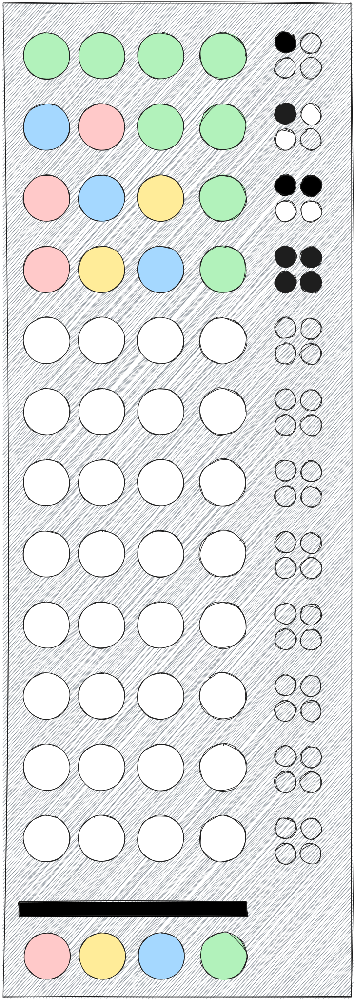
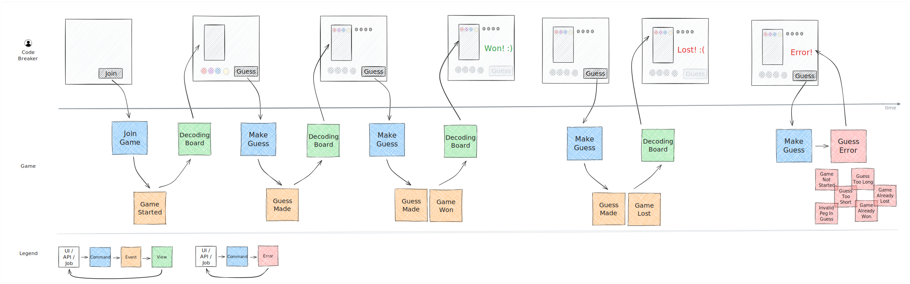

:data-uri:
:source-highlighter: rouge

= Mastermind

A https://en.wikipedia.org/wiki/Practice_(learning_method)#Deliberate_practice[deliberate practice] exercise.

The exercise can be used to practice software development techniques, learning new technologies,
finding new ways of working, etc.

== Rules

Traditionally, the game is played using:

* **a decoding board**, with a shield at one end covering a row of four large holes, and twelve additional rows containing
  four large holes next to a set of four small holes

* **code pegs** of six different colours, which will be placed in the large holes on the board

* small **key pegs**, some coloured black, some white, which will be placed in the small holes on the board

source: https://en.wikipedia.org/wiki/Mastermind_(board_game)[Wikipedia]

.Mastermind game board

// image source: https://excalidraw.com/#json=4QuOptjhjfQUUurx4zZo3,9MYvKGFTgj00QtmFoo3H7Q

In the conventional Mastermind game there are two players:

* **CodeMaker** - chooses a pattern of four code pegs and places them in the four holes covered by the shield.
  This secret code is only visible to the CodeMaker.

* **CodeBreaker** - tries to guess the secret code withing twelve turns, in both order and colour.
  Each guess is made by placing a row of code pegs on the decoding board. Once placed,
  the CodeMaker provides feedback by placing zero to four key pegs in the small holes of the row with the guess.

Feedback is provided with key pegs:

* a **black key peg** is placed for each code peg from the guess which is correct in both colour and position

* a **white key peg** is placed for each code peg from the guess which is correct in colour but in a wrong position

* if there are duplicate colours in the guess, they can only be awarded a key peg if they correspond to the same number of duplicate colours in the secret code

* **black key pegs** are placed before **white key pegs**

== Acceptance criteria

People are storytellers. Therefore, using examples to talk about business rules and document them
is a very powerful technique to build a shared understanding quickly.

We chose to use Gherkin since we like its structure, but any format would work equally well.

[NOTE]
====
Gherkin is a plain-text language with a simple structure.
Examples shown in Gherkin scenarios are meant to illustrate the business rules.

Gherkin can be used by non-programmers while it is structured enough to allow concise description of business rules
and their automation.
====

[source,gherkin]
----
Feature: Playing mastermind
As a code breaker
I want to practice breaking codes
In order to have fun

  Scenario: Joining the game
    Given a decoding board of 12 attempts
    And the code maker has placed a secret on the board
    When I join the game
    Then the game should be started with an empty board
    And I should have 12 attempts available

  Scenario Outline: Making a guess
    Given a decoding board of 12 attempts
    And the code maker placed the "<Pattern>" code pattern on the board
    When I try to break the code with "<Guess>"
    Then the code maker should give me "<Feedback>" feedback on my guess
    Examples:
      # Feedback legend:
      # B - Black - Correct colour and position
      # W - White - Correct colour but wrong position
      | Pattern               | Guess                       | Feedback |
      | Red Green Blue Yellow | Red Purple Purple Purple    | B        |
      | Red Green Blue Yellow | Purple Purple Purple Purple |          |
      | Red Green Blue Yellow | Purple Red Purple Purple    | W        |
      | Red Green Blue Yellow | Red Purple Green Purple     | B W      |
      | Red Green Blue Yellow | Red Green Blue Purple       | B B B    |
      | Red Green Blue Yellow | Red Yellow Blue Green       | B B W W  |
      | Red Green Blue Yellow | Yellow Blue Green Red       | W W W W  |
      | Red Green Blue Yellow | Red Green Blue Yellow       | B B B B  |
      | Red Green Blue Yellow | Red Red Red Purple          | B        |
      | Green Red Blue Yellow | Green Yellow Red Blue       | B W W W  |
      | Green Red Blue Yellow | Red Green Yellow Blue       | W W W W  |
      | Green Red Blue Yellow | Green Red Yellow Blue       | B B W W  |
      | Red Green Red Yellow  | Red Red Purple Purple       | B W      |
      | Red Red Red Yellow    | Red Green Purple Purple     | B        |
      | Red Red Blue Yellow   | Purple Purple Red Purple    | W        |
      | Red Blue Blue Yellow  | Purple Purple Red Red       | W        |

  Scenario: Winning a game
    Given a decoding board of 12 attempts
    And the code maker placed the "Red Green Blue Yellow" secret on the board
    When I try to break the code with an invalid pattern 11 times
    But I break the code in the final guess
    Then I should win the game
    And I should no longer be able to make guesses

  Scenario: Losing a game
    Given a decoding board of 12 attempts
    And the code maker placed the "Red Green Blue Yellow" secret on the board
    When I try to break the code with an invalid pattern 12 times
    Then I should lose the game
    And I should no longer be able to make guesses
----

== Event model

.Mastermind event model

// image source: https://excalidraw.com/#json=lEF7VZ-SRShlpzeXgr_cR,wenYsJlj4WtBHNPYfc80hg
